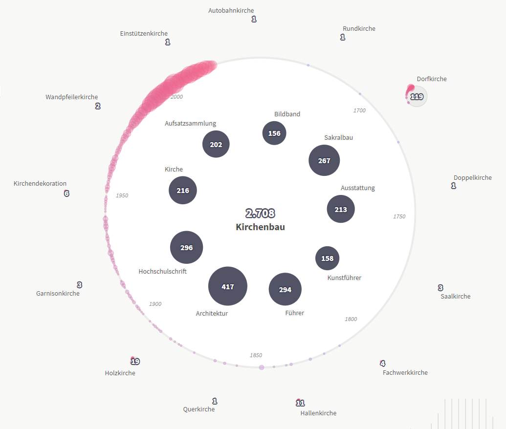

# Exploratory search prototype for [SLUB LOD-API](https://data.slub-dresden.de)




## Get started

Install the dependencies...

```bash
npm install
```

...then start [Rollup](https://rollupjs.org):

```bash
npm run dev
```

Navigate to [localhost:5000/explore](http://localhost:5000/explore). 

## Building and running in production mode

To create an optimised version of the app:

```bash
npm run build
```